<div align="center">


<h1>Data Landing Zone</h1>

<p><strong>The Institutional-Grade Platform for Standardized Data Foundation Foundations, Governance, and Multi-Cloud Infrastructure Ecosystems.</strong></p>

[]()
[]()
[]()

<br/>

> **"Industrializing data foundations to automate high-performance infrastructure."** 
> **Data Landing Zone** is an enterprise-grade platform designed to provide a secure, measurable, and highly automated foundation for global data estate operations. It orchestrates the complex lifecycle of data landing zones—from hub-and-spoke networking and identity federation to automated perimeter security and unified foundation auditing.

</div>

---

## 🏛️ Executive Summary

Fragmented data infrastructure and manual foundation provisioning are strategic operational liabilities; lack of a standardized landing zone is a primary barrier to organizational data maturity. Organizations fail to secure their data estates not because of a lack of firewalls, but because of fragmented networking standards, lack of automated infrastructure validation, and an inability to orchestrate foundation planes with operational precision.

This platform provides the **Infrastructure Intelligence Plane**. It implements a complete **Data-Landing-Zone-as-Code Framework**, enabling Data Architects and Platform teams to manage global foundation foundations as first-class citizens. By automating the identification of infrastructure bottlenecks through real-time telemetry analysis and orchestrating the provisioning of secure performance-driven landing zone policies, we ensure that every organizational data team—from central platform squads to domain-specific engineering units—is supported by default, audited for history, and strictly aligned with institutional foundation frameworks.

---

## 📐 Architecture Storytelling: Principal Reference Models

### 1. Principal Architecture: Global Data Landing Zone & Infrastructure Intelligence Plane
This diagram illustrates the end-to-end flow from foundation telemetry ingestion and multi-cloud orchestration to workspace enforcement, performance validation, and institutional platform auditing.

```mermaid
graph LR
    %% Subgraph Definitions
    subgraph FoundationIngress["Foundation & Networking Ingress"]
        direction TB
        Hub_Connectivity["Hub-and-Spoke / Transit Gateway"]
        Identity_Providers["Entra ID / AWS IAM / Okta"]
        Storage_Perimeters["Private Link / Service Endpoints"]
    end

    subgraph IntelligenceEngine["Infrastructure Intelligence Hub"]
        direction TB
        API["FastAPI Foundation Gateway"]
        Orchestrator["Global Hub & Spoke Hub"]
        Governance_Hub["Compliance & Guardrail Hub"]
        AIOps_Validator["Drift & Security Analysis Hub"]
    end

    subgraph OperationsPlane["Distributed Foundation Ecosystem"]
        direction TB
        ManagedLandingZones["Managed Standardized Landing Zones"]
        ActivePipelines["Managed Automated Secure Pipes"]
        ProvisionedVnets["Managed Trusted Infrastructure Hubs"]
    end

    subgraph OperationsHub["Institutional Data Hub"]
        direction TB
        Scorecard["Foundation Maturity Scorecard"]
        Analytics["Foundation Flow & Provisioning Velocity Stats"]
        Audit["Forensic Infrastructure Metadata Lake"]
    end

    subgraph DevOps["Data-Landing-Zone-as-Code Framework"]
        direction TB
        TF["Terraform Foundation Modules"]
        DriftBot["Productivity & Config Drift Validator"]
        ChatOps["Measurement Operations Hub"]
    end

    %% Flow Arrows
    FoundationIngress -->|1. Submit Metadata| API
    API -->|2. Orchestrate Foundation| Orchestrator
    Orchestrator -->|3. Apply Privacy Guard| Governance_Hub
    Governance_Hub -->|4. Assess Drift| AIOps_Validator
    
    AIOps_Validator -->|5. Execute Provision| OperationsPlane
    OperationsPlane -->|6. Notify Status| ChatOps
    API -->|7. Visualize Health| Scorecard
    
    Scorecard -->|8. Track Maturity| Analytics
    Scorecard -->|9. Record Performance| Audit
    
    TF -->|10. Provision Backbone| IntelligenceEngine
    DriftBot -->|11. Inject Friction Risk| Orchestrator
    Audit -->|12. Improve Operations| ManagedLandingZones

    %% Styling
    classDef ingress fill:#f5f5f5,stroke:#616161,stroke-width:2px;
    classDef intel fill:#e8eaf6,stroke:#1a237e,stroke-width:2px;
    classDef operations fill:#e1f5fe,stroke:#01579b,stroke-width:2px;
    classDef ops fill:#ede7f6,stroke:#311b92,stroke-width:2px;
    classDef devops fill:#e8f5e9,stroke:#1b5e20,stroke-width:2px;

    class FoundationIngress ingress;
    class IntelligenceEngine intel;
    class OperationsPlane operations;
    class OperationsHub ops;
    class DevOps devops;
```

### 2. The Landing Zone Lifecycle Flow
The continuous path of a data landing zone platform from initial integration (foundation) and aggregation (spoke) to active analysis (security), optimization (provision), and institutional forensic auditing (scorecard).

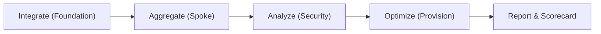

### 3. Distributed Foundation Topology
Strategically orchestrating standardized landing zones across global cloud regions, diverse cloud tenants, and multi-cloud targets, providing a unified institutional view of global foundation health and operational readiness.

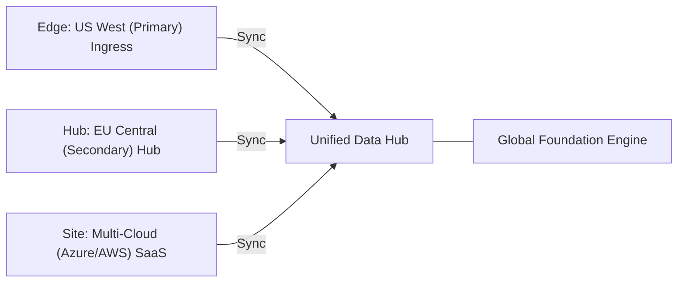

### 4. Foundation Governance & High-Trust Data Plane Protection Flow
Executing complex logic for securing the bridge between cloud services and data platforms, ensuring every organizational identity is verified, infrastructure-level privacy is maintained, and every foundation access is according to institutional standards.

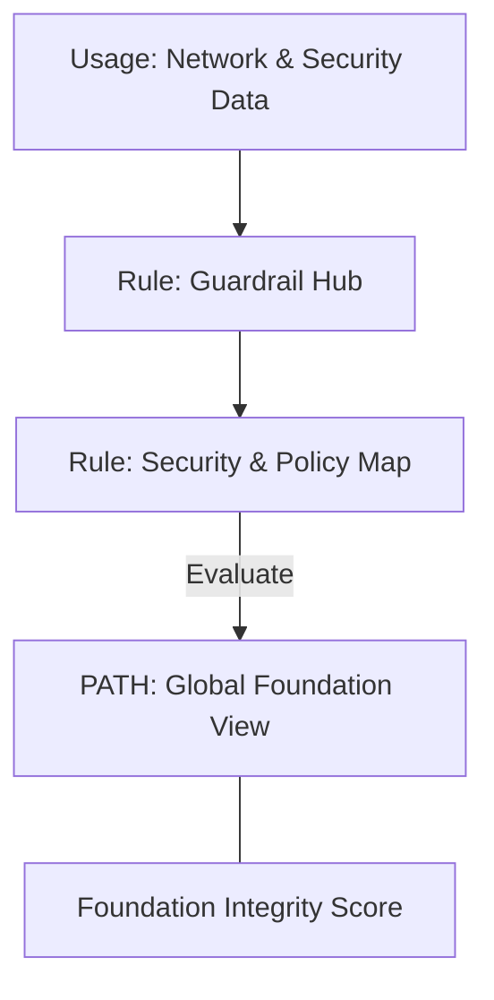

### 5. Multi-Cloud Foundation Federation & Governance Flow
Automatically managing unified landing zone standards across global regions and diverse cloud tenants, ensuring institutional data residency and perimeter boundaries by default.

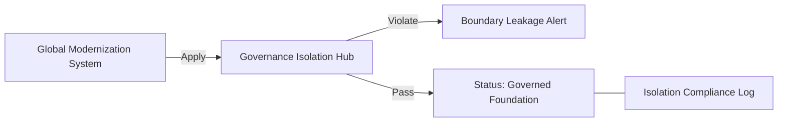

### 6. Encryption & Perimeter Protection Flow (Foundation Standard)
Managing the lifecycle of a foundation request, automatically enforcing institutional TLS 1.3 and resource encryption standards as required by security policy, ensuring zero-latency security confidence.

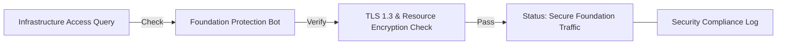

### 7. Institutional Foundation Maturity Scorecard
Grading organizational performance based on key indicators: Provisioning Success Rate, Perimeter Integrity Index, and Resource Readiness Index.

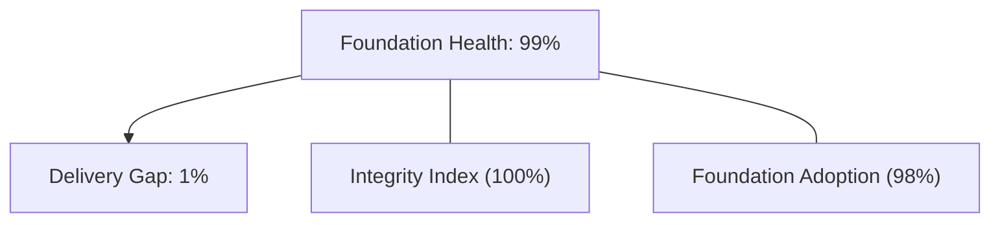

### 8. Identity & RBAC for Foundation Governance
Managing fine-grained access to foundation hubs, provisioning workers, and audit logs between CDOs, Platform Architects, and SREs.

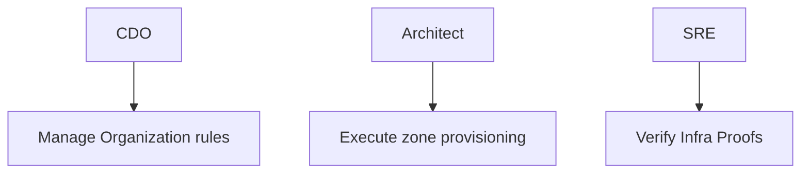

### 9. IaC Deployment: Data-Landing-Zone-as-Code Framework
Using modular Terraform to deploy and manage the versioned distribution of the foundation tracking hubs, perimeter protection workers, and forensic metadata lakes.

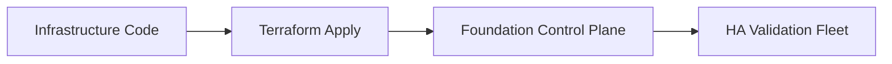

### 10. AIOps Foundation Drift & Risk Validation Flow
Using advanced analytics to identify sudden surges in network traffic, unauthorized security group changes, suspicious configuration drifts, or unusual delivery pattern changes that could result in institutional risk or foundation compromise.

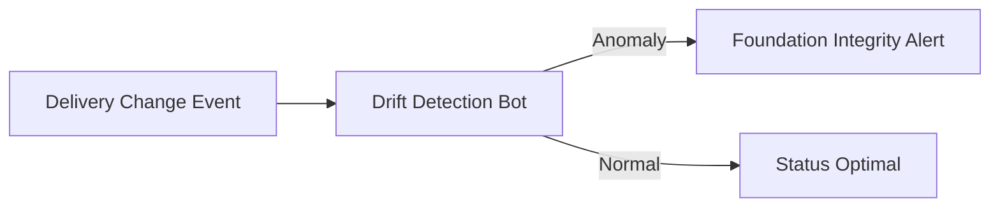

### 11. Metadata Lake for Forensic Foundation Audit
Storing long-term records of every foundation integration event (metadata), every zone provisioned, and every security policy history for institutional record-keeping, compliance auditing, and post-provisioning forensics.

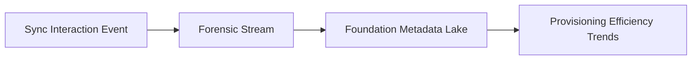

---

## 🏛️ Core Governance Pillars

1.  **Unified Foundation Coordination**: Maximizing resilience by centralizing all infrastructure measurement through a single institutional plane.
2.  **Automated Zone Provisioning**: Eliminating "manual networking" scenarios through proactive orchestration and pattern verification.
3.  **Sequential Spoke Intelligence**: Ensuring zero-interruption operations through dependency-aware spoke-driven data engineering.
4.  **Zero-Trust Perimeter Protection**: Automatically enforcing identity-based access, team-level aggregation, and policy evaluation across all infrastructure tiers.
5.  **Autonomous Operations Logic**: Guaranteeing reliability through automated industry-specific effectiveness monitoring runbooks.
6.  **Full Infrastructure Auditability**: Immutable recording of every zone change and foundation provision for institutional forensics.

---

## 🛠️ Technical Stack & Implementation

### Foundation Engine & APIs
*   **Framework**: Python 3.11+ / FastAPI.
*   **Performance Engine**: Custom Python-based logic for multi-toolchain networking and readiness metrics.
*   **Integrations**: Native connectors for Azure, AWS, GCP, and Terraform Cloud.
*   **Persistence**: PostgreSQL (Foundation Ledger) and Redis (Live State).
*   **Auth Orchestrator**: Federated OIDC/SAML for least-privilege foundation management access.

### Governance Dashboard (UI)
*   **Framework**: React 18 / Vite.
*   **Theme**: Dark, Slate, Indigo (Modern high-fidelity productivity aesthetic).
*   **Visualization**: D3.js for delivery topologies and Recharts for readiness velocity analytics.

### Infrastructure & DevOps
*   **Runtime**: AWS EKS or Azure Kubernetes Service (AKS) for management plane.
*   **Measurement Hub**: Managed event sourcing for immutable productivity timeline reconstruction.
*   **IaC**: Modular Terraform for deploying the foundation landing zone and validation fleet.

---

## 🏗️ IaC Mapping (Module Structure)

| Module | Purpose | Real Services |
| :--- | :--- | :--- |
| **`infrastructure/foundation_hub`** | Central management plane | EKS, PostgreSQL, Redis |
| **`infrastructure/enforcers`** | Distributed zone provisioners | Azure, AWS, GCP APIs |
| **`infrastructure/secure_pipes`** | Data Ingestion Hubs | Webhooks, Lambda |
| **`infrastructure/auditing`** | Forensic modernization sinks | S3, Athena, Quicksight |

---

## 🚀 Deployment Guide

### Local Principal Environment
```bash
# Clone the Data Landing Zone repository
git clone https://github.com/devopstrio/data-landingzone.git
cd data-landingzone

# Configure environment
cp .env.example .env

# Launch the Foundation stack
make init

# Trigger a mock zone update and automated guardrail validation simulation
make simulate-lz
```

Access the Management Portal at `http://localhost:3000`.

---

## 📜 License
Distributed under the MIT License. See `LICENSE` for more information.

---
<div align="center">
  <p>© 2026 Devopstrio. All rights reserved.</p>
</div>
