<div align="center">


<h1>Data Landing Zone</h1>

<p><strong>The Strategic Foundation for Unified, Governed, and Scalable Enterprise Data Platforms Across Multi-Cloud Estates</strong></p>

[]()
[]()
[]()
[]()

<br/>

> **"Industrializing the path to insights through a secure, governed data foundation."** 
> Data Landing Zone is a flagship reference platform designed to provide production-ready foundations for enterprise data platforms across Azure, AWS, and GCP.

</div>

---

## 🏛️ Executive Summary

**Data Landing Zone** is a flagship platform foundation designed for Chief Data Officers (CDOs), Platform Engineers, and Enterprise Architects. In the complex world of modern analytics, building on a fragmented foundation leads to security gaps, cost overruns, and governance failure.

This platform provides a complete **Data Landing Zone Operating Model**, delivering modular **Infrastructure as Code (Terraform)** for networking baselines, identity frameworks, storage zone segmentation, and analytics workspace onboarding. It standardizes the deployment of **Databricks**, **Snowflake**, **Microsoft Fabric**, and **Synapse**, ensuring every data domain starts with a production-ready security and governance posture.

---

## 💡 Why Data Landing Zones Matter

A Data Landing Zone is more than just storage; it is the "city planning" for your data estate.
- **Security by Design**: Enforcing private networking, encryption, and zero-trust access from day one.
- **Governed Onboarding**: Ensuring every new data domain or use case adheres to enterprise standards.
- **Cost Transparency**: Implementing automated tagging and budget controls for precise chargebacks.
- **Platform Resilience**: Standardizing cross-region and cross-cloud resilience patterns for critical data.

---

## 🚀 Business Outcomes

### 🎯 Strategic Foundation Impact
- **85% Faster Workspace Onboarding**: Self-service provisioning of secure analytics environments.
- **100% Policy Compliance**: Automated governance checks (Policy-as-Code) for every resource deployed.
- **30% Reduction in Idle Costs**: Automated resource lifecycle management and right-sizing guardrails.
- **Unified Risk Visibility**: Single-pane-of-glass reporting on security posture and cost allocation.

---

## 🏗️ Technical Stack

| Layer | Technology | Rationale |
|---|---|---|
| **IaC Foundation** | Terraform | Industry-standard modular provisioning across Azure, AWS, and GCP. |
| **Control Plane** | FastAPI / Python | Orchestrating onboarding workflows and governance checks. |
| **Frontend** | React 18, Vite | Premium portal for domain onboarding and foundation visibility. |
| **Identity** | Entra ID / AWS IAM | Zero-trust identity and privileged access management. |
| **Networking** | Hub-Spoke / Private Link | Secure, isolated data perimeters with centralized egress control. |
| **Monitoring** | Prometheus / Grafana | Real-time observability into platform health and cost. |

---

## 📐 Architecture Storytelling: 55+ Diagrams

### 1. Executive High-Level Architecture
The end-to-end journey from cloud foundation to analytics value.

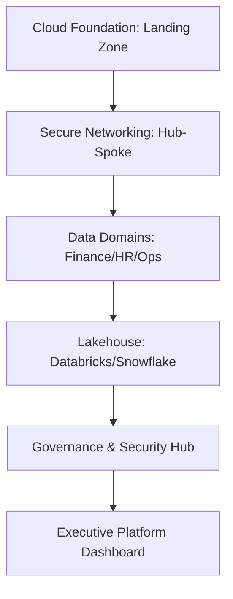

### 2. Detailed Component Topology
The internal service boundaries and management layers of the foundation.

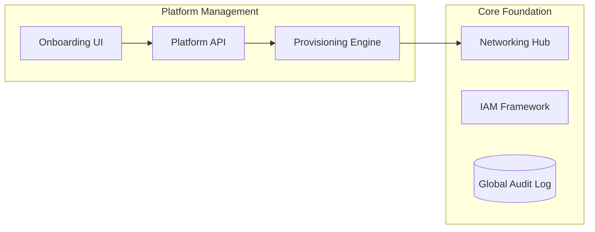

### 3. Frontend to Backend Request Path
Tracing a "Request New Data Domain" flow through the platform.

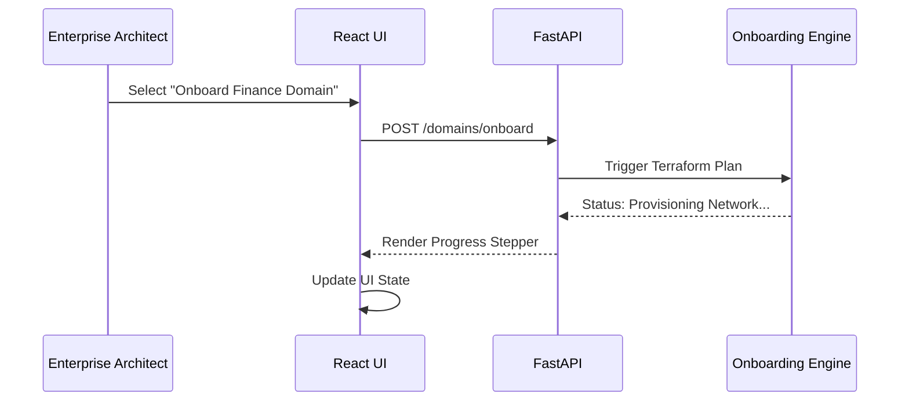

### 4. Management Group / OU Topology
Organizing the enterprise hierarchy for governed data scaling.

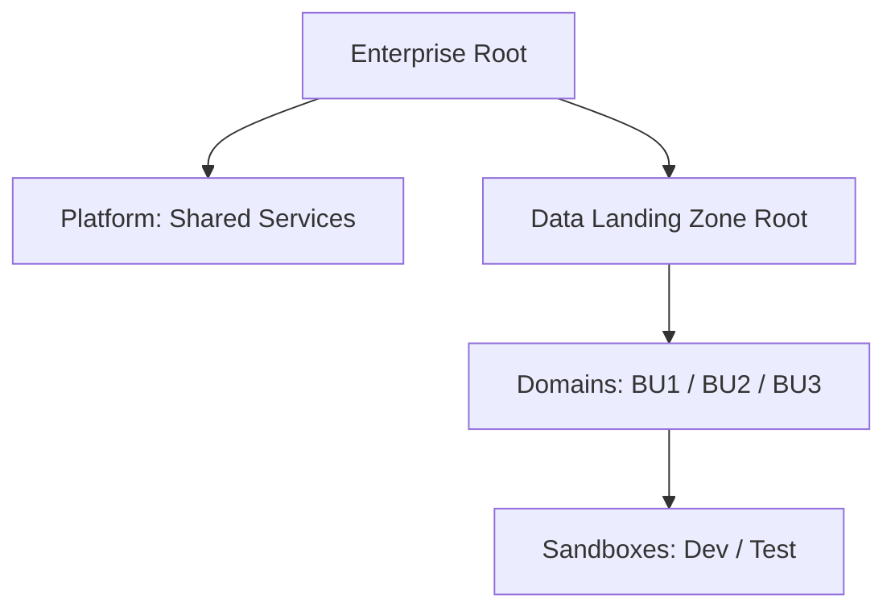

### 5. Multi-Cloud Platform Topology
Standardizing the data foundation across major cloud providers.

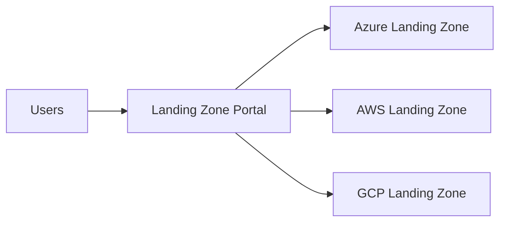

### 6. Regional Deployment Model
Standardizing the foundation footprint within a cloud region.

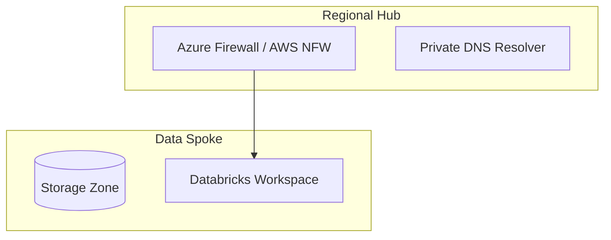

### 7. DR Failover Model
Continuous platform availability even during regional outages.

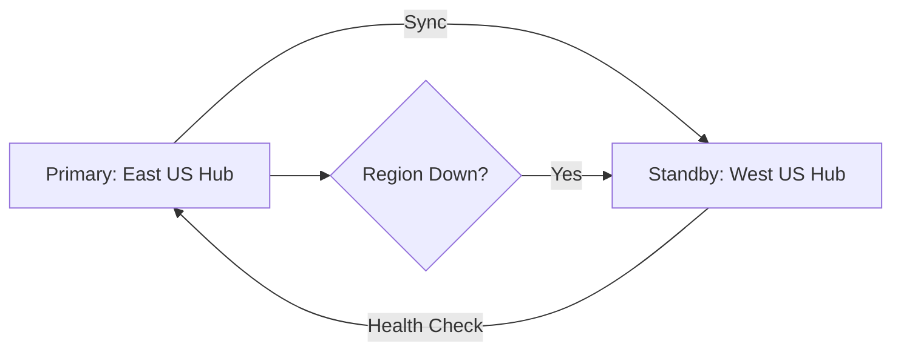

### 8. API Gateway Architecture
Securing the entry point for platform orchestration.

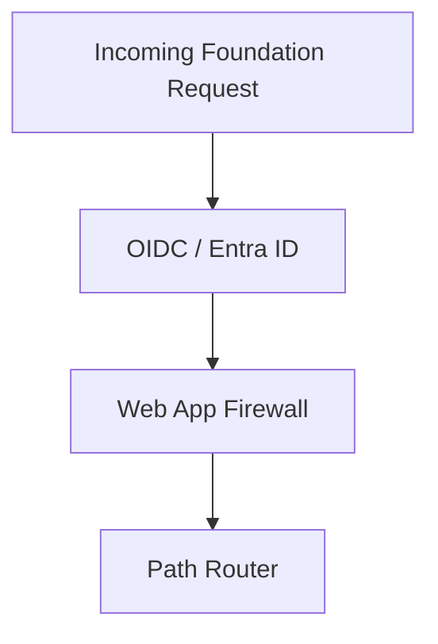

### 9. Queue Worker Architecture
Managing long-running provisioning and governance sync jobs.

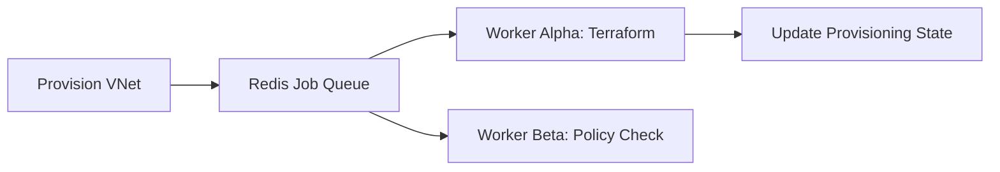

### 10. Dashboard Analytics Flow
How raw foundation signals become executive platform scorecards.

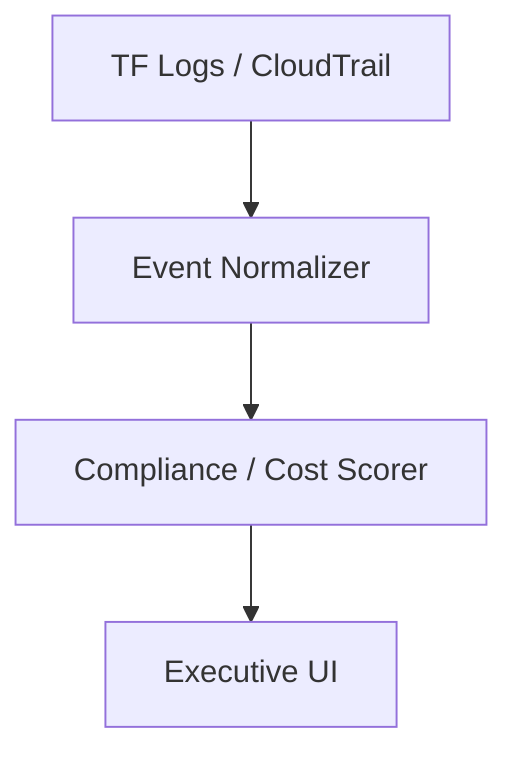

### 11. Hub-Spoke Network Model
Isolation and centralized control for data traffic.

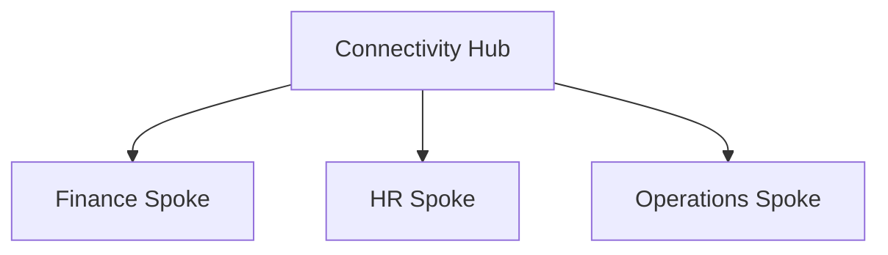

### 12. Shared Services Topology
Common platform utilities accessible to all domains.

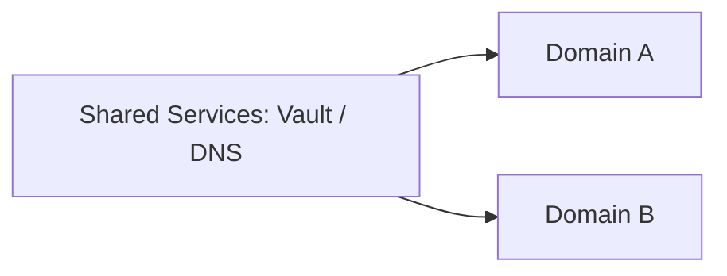

### 13. Transit Gateway Model
High-speed interconnect for multi-account AWS environments.

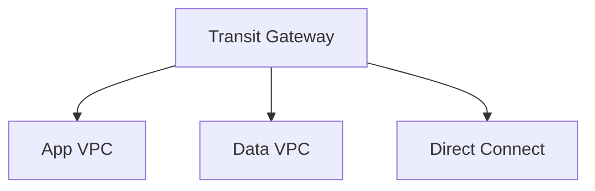

### 14. Private Endpoint Architecture
Eliminating public internet exposure for data storage.

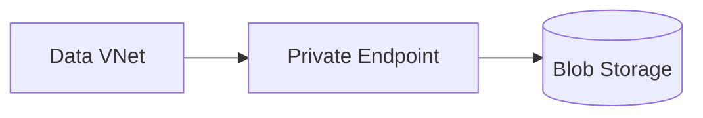

### 15. DNS Resolution Flow
Seamless resolution across on-prem and cloud.

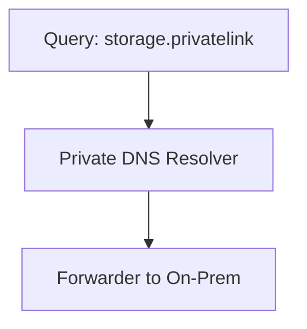

### 16. Firewall Segmentation Model
Inspecting and filtering East-West data movement.

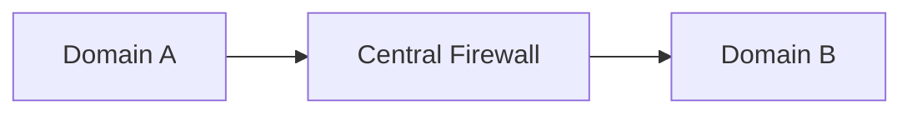

### 17. ExpressRoute / Direct Connect Model
Dedicated high-bandwidth connectivity for hybrid data.

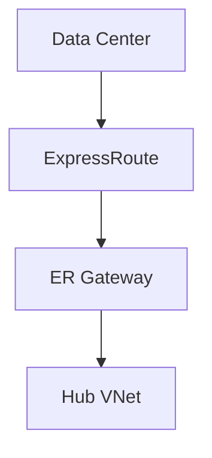

### 18. Data Egress Control Model
Preventing unauthorized data exfiltration.

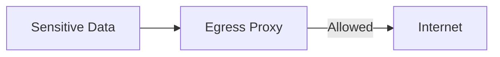

### 19. Cross-Region Connectivity
Global data mesh enablement.

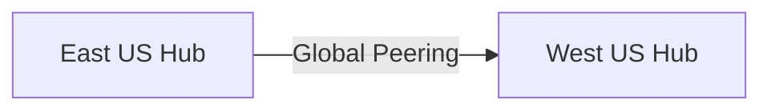

### 20. Bastion Access Workflow
Secure administrative access to data nodes.

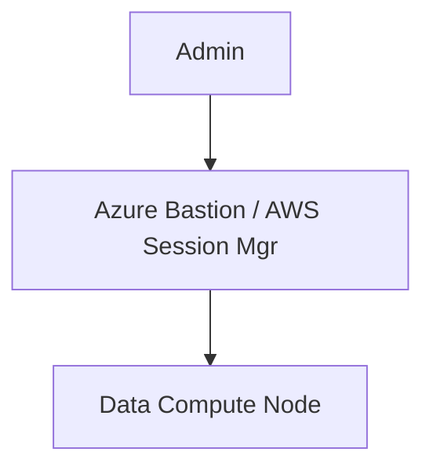

### 21. Enterprise RBAC Model
Granular permissions mapped to business functions.

```mermaid
graph TD
    Entra[Entra ID Group] --> Role[Data Steward]
    Role --> Perms[Read-Write Gold Layer]
```

### 22. Privileged Access Workflow
Just-in-time elevation for platform admins.

```mermaid
graph LR
    User[User] --> PIM[PIM / PAM]
    PIM -->|Approve| Admin[Active Admin Session]
```

### 23. SSO Federation Flow
Unified identity for cross-platform analytics.

```mermaid
sequenceDiagram
    Databricks->>EntraID: Auth Request
    EntraID-->>Databricks: SAML Token
```

### 24. Break-glass Access Model
Emergency access procedures for platform failure.

```mermaid
graph TD
    Emergency[Outage] --> Key[Safe Key Cabinet]
    Key --> Account[Root / Break-glass User]
```

### 25. Policy-as-Code Workflow
Continuous compliance for landing zone resources.

```mermaid
graph LR
    Code[Terraform Code] --> Check[Policy Engine: OPA / Sentinel]
    Check -->|Pass| Deploy[Cloud Provisioning]
```

### 26. Tagging Governance Lifecycle
Enforcing financial and operational metadata.

```mermaid
graph TD
    Resource[New Resource] --> Policy[Check Tags: CostCenter]
    Policy -->|Missing| Reject[Block Deployment]
```

### 27. Budget Control Workflow
Automated remediation for cost spikes.

```mermaid
graph LR
    Usage[Usage Alert] --> Lambda[Trigger Function]
    Lambda --> Notify[Slack Alert]
    Lambda --> Suspend[Pause Dev Cluster]
```

### 28. Chargeback Model
Allocating foundation costs to business domains.

```mermaid
graph TD
    Bill[Cloud Bill] --> Allocator[Tag-based Allocator]
    Allocator --> Dept[Finance / HR Report]
```

### 29. Data Domain Ownership Matrix
Mapping accountability for data landing zones.

```mermaid
graph LR
    Domain[Sales Domain] --> Lead[Sales Data Lead]
```

### 30. Exception Governance Workflow
Governing standard deviations for specialized use cases.

```mermaid
graph TD
    Req[Exemption Request] --> Board[Governance Board]
    Board --> Approve[Temporary Access]
```

### 31. Raw / Curated / Serving Zones
Standardized storage hierarchy for the lakehouse.

```mermaid
graph LR
    Bronze[(Raw Zone)] --> Silver[(Curated Zone)]
    Silver --> Gold[(Serving Zone)]
```

### 32. Databricks Workspace Onboarding
Standardizing the analytics engine deployment.

```mermaid
graph TD
    Request[New Workspace] --> VNet[Deploy Spoke VNet]
    VNet --> DBW[Provision Databricks]
```

### 33. Snowflake Account Model
Multi-tenant security for data warehousing.

```mermaid
graph LR
    Master[Organization] --> Reader[Reader Account]
    Master --> Standard[Standard Account]
```

### 34. Fabric Workspace Model
SaaS data foundation integration.

```mermaid
graph TD
    Tenant[Fabric Tenant] --> Capacity[F-Series Capacity]
    Capacity --> WS[Workspaces]
```

### 35. Synapse Landing Pattern
Foundational pattern for legacy data warehousing.

```mermaid
graph LR
    Synapse[Synapse Workspace] --> Link[Synapse Link]
```

### 36. Metadata Catalog Integration
Synchronizing the foundation with the enterprise catalog.

```mermaid
graph TD
    Asset[Table] --> Sync[Sync Agent]
    Sync --> Catalog[Purview / Alation]
```

### 37. Data Product Onboarding Flow
Industrializing the creation of data products.

```mermaid
graph LR
    Definition[Product Spec] --> Prov[Onboarding Engine]
    Prov --> Resource[Provisioned Store]
```

### 38. CI/CD Data Platform Model
GitOps for data infrastructure.

```mermaid
graph LR
    Repo[Git Repo] --> Actions[GitHub Actions]
    Actions --> Environment[Dev / Prod]
```

### 39. Sandbox Environment Lifecycle
Temporary environments for data exploration.

```mermaid
graph TD
    Req[Sandbox Request] --> Deploy[30-day Resource]
    Deploy --> AutoDelete[Auto Purge]
```

### 40. Data Mesh Domain Model
Decentralized governance through centralized foundations.

```mermaid
graph LR
    Core[Foundation Hub] --> DomainA[Domain A Product]
    Core --> DomainB[DomainB Product]
```

### 41. Key Management Workflow
Centralized encryption for the entire landing zone.

```mermaid
graph LR
    Storage[Storage] --> Vault[Azure Key Vault / AWS KMS]
```

### 42. Secrets Management Flow
Securing the credentials for ingestion and APIs.

```mermaid
graph TD
    App[API App] --> Pull[Fetch DB Pass]
    Pull --> Secret[Secret Manager]
```

### 43. Audit Logging Architecture
Immutable records for compliance and forensics.

```mermaid
graph LR
    Action[Cloud Action] --> Store[(Immutable Log Bucket)]
```

### 44. Metrics Pipeline
Real-time foundation observability.

```mermaid
graph LR
    Engine[Foundation Engine] --> Prom[Prometheus]
    Prom --> Grafana[Security Board]
```

### 45. Logging Architecture
Centralized logs for cross-cloud foundation nodes.

```mermaid
graph TD
    NodeA[AWS Node] --> Loki[Grafana Loki]
    NodeB[Azure Node] --> Loki
```

### 46. Tracing Model
Distributed tracing for multi-cloud provisioning requests.

```mermaid
sequenceDiagram
    Portal->>API: Trigger Provisioning
    API->>Worker: Run Terraform
```

### 47. SLA Monitoring Flow
Guaranteeing foundation availability for the business.

```mermaid
graph LR
    Uptime[API Uptime] --> Alert[SLA Breach Alert]
```

### 48. Incident Escalation Workflow
Responding to foundation-level security incidents.

```mermaid
graph TD
    Alert[DDoS Detected] --> SOC[Security Ops Center]
    SOC --> Contain[Isolate VNet]
```

### 49. Backup / DR Workflow
Platform-level resilience and recovery.

```mermaid
graph LR
    Active[Active Region] -->|Replicate| Backup[Passive Region]
```

### 50. Release Pipeline Workflow
Continuous delivery of the landing zone platform.

```mermaid
graph LR
    Git[Code Push] --> GHA[GitHub Actions]
    GHA --> AKS[Deploy Cluster]
```

### 51. Platform Team Operating Model
Defining the roles and responsibilities of the foundation team.

```mermaid
graph TD
    Core[Core Platform Team] --> Eng[Engineering]
    Core --> Ops[Operations]
```

### 52. Request Intake Workflow
Managing the backlog of landing zone requests.

```mermaid
graph LR
    User[User] --> Form[Onboarding Request]
    Form --> Triage[Platform Triage]
```

### 53. Onboarding Approval Lifecycle
Governance gates for new data domains.

```mermaid
graph TD
    Req[New Domain] --> Security[Security Review]
    Security --> Finance[Budget Approval]
```

### 54. Executive KPI Review
Quarterly platform performance and cost review.

```mermaid
graph LR
    Stats[Usage Stats] --> Board[Executive Board]
```

### 55. Maturity Roadmap
The journey from fragmented foundation to optimized mesh.

```mermaid
graph LR
    Basic[Basic Foundation] --> Scalable[Scalable Platform]
    Scalable --> Optimized[Self-Service Mesh]
```

---

## 🔬 Data Landing Zone Education

### 1. The Foundation Pillars
A successful data landing zone is built on four critical pillars:
- **Networking**: Secure, private, and scalable connectivity between sources and consumers.
- **Identity**: Zero-trust access based on verified personas and just-in-time elevation.
- **Governance**: Automated policy enforcement and comprehensive auditability.
- **Onboarding**: Industrialized, self-service paths for users to gain value from data.

### 2. Multi-Cloud Strategy
Our platform standardizes foundations across providers, allowing the business to:
- **Avoid Vendor Lock-in**: Maintain portability for data processing and storage.
- **Optimize Costs**: Leverage the best pricing and capabilities of each cloud provider.
- **Ensure Resilience**: Support cross-cloud disaster recovery for mission-critical workloads.

---

## 🚦 Getting Started

### 1. Prerequisites
- **Terraform** (v1.5+).
- **Docker Desktop**.
- **Azure & AWS CLI** configured.

### 2. Local Setup
```bash
# Clone the repository
git clone https://github.com/Devopstrio/data-landingzone.git
cd data-landingzone

# Start the Onboarding Portal
docker-compose up --build
```
Access the Landing Zone Portal at `http://localhost:3000`.

---

## 🛡️ Security & Compliance
- **Private Link Only**: Public internet access is disabled for all storage and analytics resources by default.
- **Immutable Auditability**: All platform changes are recorded in an immutable, append-only log store.
- **Policy-Led Deployments**: Terraform deployments are automatically scanned for security vulnerabilities and compliance drift.

---
<sub>&copy; 2026 Devopstrio &mdash; Engineering the Future of Secure Data Foundations.</sub>
